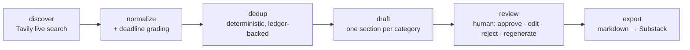
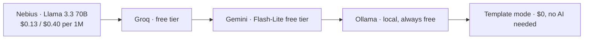

# SL Tech Radar

**Never miss a deadline that matters.**

An AI assistant that powers **SL Tech Students Weekly** — a newsletter for Sri Lankan tech undergrads. Every Saturday it discovers hackathons, internships, courses, and scholarships, drafts the edition, and hands you a 15-minute approve/edit/reject review queue. You keep the judgment; the robot does the research.

Built lifetime-workable: it runs on $50 of promo credits for a century, and keeps working when the credits, the internet, or every paid API is gone.

## How it works



1. **Discover** — per-category Tavily queries (hackathons, internships, courses, scholarships), scoped to Sri Lankan undergrads.
2. **Normalize + grade** — snippets are parsed for deadlines with a confidence grade (`high | medium | low`); low-confidence dates get flagged `VERIFY`, never silently published.
3. **Dedup** — deterministic matching against the seen-events ledger. `NEW` items get drafted; `SEEN` ones are skipped; uncertain ones go to a human.
4. **Draft** — one markdown section per category, with cited sources and the earliest deadline surfaced for sorting.
5. **Review** — keyboard-driven queue (`j/k` navigate, `a` approve, `e` edit, `r` reject, `g` regenerate). Every rejection feeds the ledger with its reason.
6. **Export** — approved sections assemble into `# SL Tech Students Weekly — YYYY-WNN` markdown, ready to paste into Substack.

### Provider fallback chain

The LLM layer is an ordered chain, not a single vendor. The first *available* provider serves; everything else is standby.



Order is configurable: `APP_PROVIDERS_ORDER=groq,nebius,gemini,ollama,template`.
`GET /api/providers/status` shows the live chain; `GET /api/providers/fallback-test` proves the failover works.

## The cost math

The whole design is anchored on one number: **$50 of Nebius Token Factory credit ≈ 100+ years of newsletters.** Here's the arithmetic (also in `backend/.../cost/CostEstimator.java`):

| Item | Tokens | Price | Cost |
|---|---|---|---|
| One Saturday run — input (candidates → 4 section drafts) | ~8,000 | $0.13 / 1M | $0.00104 |
| One Saturday run — output (4 markdown sections) | ~3,000 | $0.40 / 1M | $0.00120 |
| **Per week** | | | **≈ $0.0022** |
| Per year (×52) | | | ≈ $0.115 |
| $50 credit ÷ $0.115/yr | | | ≈ **430 years** → reported as "100+ years" (conservative cap per the API contract) |

And that's the *heavy* path. In practice it's cheaper:
- **Tavily**: 1,000 free searches/month; the pipeline uses ~40/week → **$0**.
- **Groq / Gemini free tiers, local Ollama, template mode**: **$0**.
- **Weekly caching + deterministic dedup**: unchanged candidates are never re-drafted, so most weeks cost a fraction of the heavy estimate.

When everything is unavailable, template mode still produces a complete, honest edition — marked `"modelUsed": "template"`.

## Lifetime-workability design

The requirement: *this must keep working for a lifetime, not die when free credits run out.*

- **Provider abstraction** — `LlmProvider` interface; adding a new vendor is one class + one config line. No call site knows which model is behind it.
- **Cache everything** — Caffeine-backed weekly caches for search results and drafts; a week re-run never re-pays for the same tokens.
- **Graceful degradation** — keys missing? → curated mock data + template drafts. Providers down? → chain falls through to template. Backend unreachable? → the frontend ships a bundled mock dataset (`NEXT_PUBLIC_MOCK=true`, the default).
- **Ledger as memory** — every discovered event is recorded with its fate (candidate / approved / rejected / published), so dedup and rejection reasons compound in value over time.
- **No secrets in the repo** — all keys via environment; `.env.example` files document every variable; `.gitignore` excludes real `.env` files.

## Quickstart

### Prereqs
- Java 21 (backend) · Node 24 (frontend) · Docker (optional, for Postgres)

### Mock mode (zero setup — the LinkedIn demo runs like this)
```bash
# backend (H2 in-memory, no Docker, no keys)
cd backend && SPRING_PROFILES_ACTIVE=dev java -jar target/sl-tech-radar-backend-1.0.0.jar

# frontend (bundled mock data, no backend needed)
cd frontend && npm install && NEXT_PUBLIC_MOCK=true npm run dev
```
Open http://localhost:3000. Every endpoint works; drafts are template-mode, clearly labeled.

### Live mode
```bash
# 1. copy env templates and add keys
cp backend/.env.example backend/.env        # NEBIUS_API_KEY etc.
cp frontend/.env.example frontend/.env.local # NEXT_PUBLIC_API_URL=http://localhost:8080

# 2. backend (dev profile, still H2; drop SPRING_PROFILES_ACTIVE for Postgres)
cd backend && SPRING_PROFILES_ACTIVE=dev java -jar target/sl-tech-radar-backend-1.0.0.jar

# 3. frontend
cd frontend && npm install && npm run dev
```

### Full stack with Docker
```bash
docker compose up --build        # postgres + backend + frontend
```
The backend waits for Postgres to be healthy; API keys pass through from your shell env (`${NEBIUS_API_KEY:-}`) — never baked into images.

## API

The contract is frozen at [`API_CONTRACT.md`](API_CONTRACT.md) — backend and frontend implement exactly it.

| Area | Endpoints |
|---|---|
| Radar runs | `POST /api/radar/runs` → poll `GET /api/radar/runs/{id}` → `GET …/candidates` |
| Drafts | `POST /api/drafts/generate` · `GET /api/drafts?edition=` · `PUT /api/drafts/{id}` · `POST …/approve` `…/reject` `…/regenerate` |
| Editions | `GET /api/editions` · `POST /api/editions/{id}/export` |
| Ledger | `GET /api/ledger` |
| Providers | `GET /api/providers/status` · `GET /api/providers/fallback-test` |

Errors are always `{ "error": "message" }`. Enums: categories `hackathons|internships|courses|scholarships`; draft status `draft|approved|edited|rejected`; dedup `NEW|SEEN|VERIFY`; run `queued|running|drafting|in_review|done|failed`.

## Frontend routes

| Route | What it does |
|---|---|
| `/` | Dashboard — run the Saturday pipeline, provider chain status, this week's numbers |
| `/discover` | Live search per category, dedup badges, deadline chips |
| `/review` | The 15-minute queue: approve / edit / reject / regenerate, export to markdown |
| `/editions` | Archive — what shipped, what was cut and why, export history, per-edition cost |
| `/settings` | Provider keys, cache controls, mock-mode toggle docs |

## Environment variables

Backend (`backend/.env.example`) and frontend (`frontend/.env.example`) document every variable. The ones that matter:

| Variable | Default | Purpose |
|---|---|---|
| `NEBIUS_API_KEY` / `GROQ_API_KEY` / `GEMINI_API_KEY` | — | LLM providers (any subset; missing ones are skipped) |
| `TAVILY_API_KEY` | — | Live discovery search (1k free/mo) |
| `LANGSMITH_API_KEY` | — | Tracing; activates only when set |
| `APP_PROVIDERS_ORDER` | `nebius,groq,gemini,ollama,template` | Fallback priority |
| `APP_MOCK_ENABLED` | `true` | Mock mode when keys are absent |
| `SPRING_PROFILES_ACTIVE` | — | `dev` = H2 in-memory, zero dependencies |
| `DB_HOST/DB_PORT/DB_NAME/DB_USER/DB_PASSWORD` | `localhost/5432/sltechradar/radar/radar-dev` | Postgres (default profile) |
| `NEXT_PUBLIC_API_URL` | — | Backend URL; unset = mock mode |
| `NEXT_PUBLIC_MOCK` | `true` | Force bundled mock data |

## Project structure

```
app/
├── API_CONTRACT.md          # frozen v1 — both sides implement exactly this
├── QA_REPORT.md             # end-to-end QA: endpoint table, bugs fixed
├── DEMO_SCRIPT.md           # 60-sec LinkedIn screen-recording script
├── LINKEDIN_POST_DRAFT.md   # the launch post
├── docker-compose.yml       # postgres + backend + frontend
├── backend/                 # Spring Boot 4.0.8 · Java 21
│   ├── src/main/java/lk/sltech/radar/
│   │   ├── web/             # RadarController, DraftController, ProviderController, ArchiveController
│   │   ├── pipeline/        # discover → normalize → dedup → grade → draft
│   │   ├── providers/       # LlmProvider chain: nebius/groq/gemini/ollama/template
│   │   ├── cost/            # CostEstimator (the 100+ year math)
│   │   └── domain/          # JPA entities: runs, candidates, drafts, editions, ledger
│   ├── Dockerfile
│   └── docker-compose.yml   # local stack (postgres; backend optional via --profile app)
├── frontend/                # Next.js 16 · TypeScript
│   ├── src/app/             # / · /discover · /review · /editions · /settings
│   └── src/lib/             # api.ts (contract client + mock fallback), mock.ts, types.ts
├── assets/videos/           # intro-stinger, promo-clip, outro-bumper (demo bookends)
└── ../research-brief.md     # the deep research this was built from
```

## Roadmap (Phase 3 ideas)

- **Scheduled Saturday runs** — cron/Quartz trigger + email digest of the review queue.
- **Deadline watch** — push/DM reminders 7 days and 48 hours before each tracked deadline.
- **Multi-newsletter** — same pipeline, different verticals (design students, business students).
- **RAG over past editions** — "what did we cover about internships in March?" search.
- **LangSmith eval dataset** — rejection reasons already feed a prompt-improvement loop; wire the dataset.
- **Sinhala/Tamil summaries** — one-paragraph TL;DR per edition for wider reach.
- **Public API + embed widget** — let student societies embed "this week's deadlines" on their sites.

## License

MIT — see [LICENSE](LICENSE).
